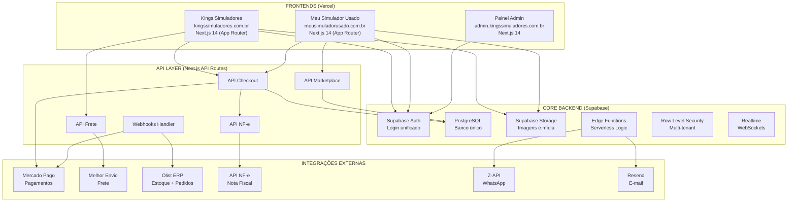
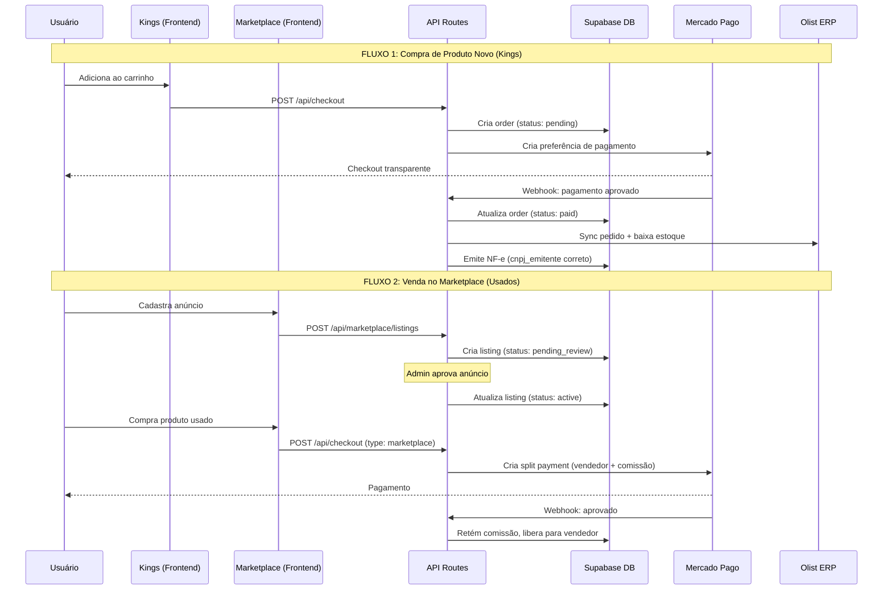
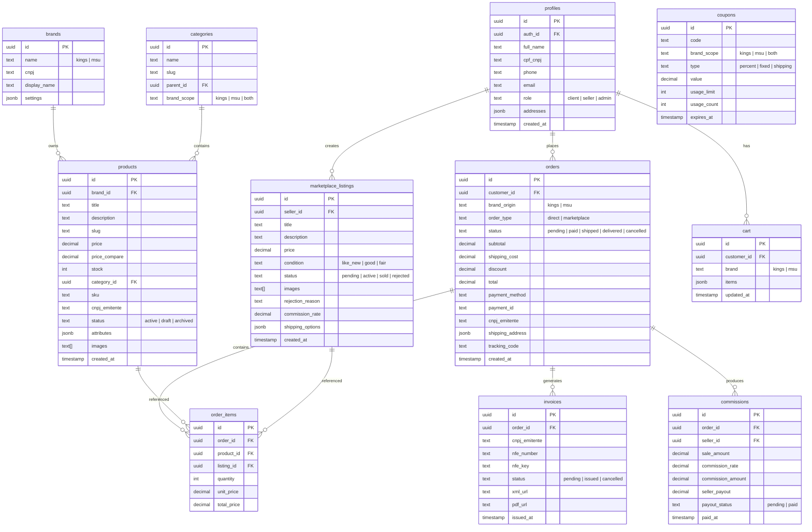

# 🏗️ Arquitetura Unificada — Kings Simuladores + Meu Simulador Usado

## Visão Geral

Unificar **Kings Simuladores** (e-commerce de novos) e **Meu Simulador Usado** (marketplace de usados) em um único ecossistema com **backend centralizado** e **frontends independentes**, preparado para escalar como SaaS e incorporar futuras plataformas (GRIDHUB, app mobile, etc.).

> [!TIP]
> **Metodologia GSD Integrada:** Este plano incorpora os melhores conceitos do framework **Get Shit Done (GSD)** — spec-driven development, execução por ondas paralelas, verificação automatizada, context engineering, e qualidade em cada fase. A filosofia é: **sem teatro corporativo, só execução eficiente com qualidade real.**

---

## User Review Required

> [!IMPORTANT]
> **Decisão de domínios:** O plano assume que os domínios `kingssimuladores.com.br` e `meusimuladorusado.com.br` continuarão separados, ambos hospedados na Vercel como projetos distintos apontando para o mesmo backend Supabase. Confirme se isso está correto.

> [!IMPORTANT]
> **Migração de dados:** A Kings atual roda na Loja Integrada e o Meu Simulador Usado é um SPA com Firebase. Será necessário migrar produtos e usuários existentes. Deseja manter os dados atuais ou iniciar do zero?

> [!WARNING]
> **Gateway de pagamento:** O plano usa **Mercado Pago** como gateway principal (conforme PROJECT.md). Caso queira Stripe ou PagSeguro como fallback, indique agora.

> [!IMPORTANT]
> **ERP Olist:** O PROJECT.md menciona integração bidirecional com Olist. Confirme se o contrato com Olist já está ativo e se temos acesso à API.

---

## 1. 🏗️ Arquitetura Completa do Sistema



### Estratégia Multi-Branding

| Aspecto | Kings Simuladores | Meu Simulador Usado |
|---------|------------------|---------------------|
| **URL** | `kingssimuladores.com.br` | `meusimuladorusado.com.br` |
| **Identidade** | Premium, dark, racing | Marketplace, community |
| **Funcionalidade** | E-commerce B2C (novos) | Marketplace C2C (usados) |
| **CNPJ** | CNPJ Kings | CNPJ Usado (ou mesmo) |
| **Supabase** | Mesmo projeto | Mesmo projeto |
| **Design System** | Compartilhado (`@kings/ui`) | Compartilhado (`@kings/ui`) |

---

## 2. 🔄 Fluxo de Dados Entre Plataformas



---

## 3. 🧠 Modelagem do Banco de Dados



---

## 4. 🔌 Estratégia de Integração

### 💰 Mercado Pago (Pagamentos)

| Cenário | Implementação |
|---------|---------------|
| **Kings (B2C)** | Checkout Transparente → Pix, Boleto, Cartão 12x |
| **Marketplace (C2C)** | Split Payment → Dinheiro vai pro vendedor, comissão retida |
| **Pedido misto** | 2 payments separados (1 por CNPJ) |
| **Webhooks** | `/api/webhooks/mercadopago` → atualiza status do pedido |

### 📦 Melhor Envio (Frete)

| Funcionalidade | Implementação |
|----------------|---------------|
| **Cotação** | API Melhor Envio calcula em tempo real |
| **Geração de etiqueta** | Após pagamento aprovado |
| **Rastreio** | Webhook atualiza `tracking_code` no pedido |

### 🧾 Nota Fiscal (NF-e)

| Cenário | Implementação |
|---------|---------------|
| **Pedido simples** | 1 NF emitida pelo `cnpj_emitente` do produto |
| **Pedido misto (2 CNPJs)** | 2 NFs paralelas, uma por CNPJ |
| **Marketplace** | NF emitida pelo vendedor (ou pela plataforma como intermediária) |
| **API** | NFe.io, Focusnfe ou Enotas |

### 🔗 Olist ERP

| Funcionalidade | Implementação |
|----------------|---------------|
| **Sync estoque** | Webhook bidirecional → Olist ↔ Supabase |
| **Sync pedidos** | Pedido pago → Push para Olist |
| **Catálogo** | Produtos importados/syncados |

### 📱 Notificações

| Canal | Ferramenta | Trigger |
|-------|-----------|---------|
| **WhatsApp** | Z-API | Pedido confirmado, enviado, entregue |
| **E-mail** | Resend | Confirmação, NF, recuperação carrinho |

---

## 5. 🚀 Plano de Desenvolvimento por Fases (GSD-Style)

> [!TIP]
> **Inspiração GSD:** Cada fase segue o ciclo **Discuss → Research → Plan → Execute → Verify → Ship**. Tarefas são atômicas, paralelizáveis quando possível, e cada uma tem critérios de verificação embutidos. Contexto fresco a cada execução. Commits atômicos por tarefa.

### Estrutura `.planning/` do Projeto (GSD-Style)

```
.planning/
├── PROJECT.md              # Visão do projeto (sempre carregado)
├── REQUIREMENTS.md         # V1/V2/Out of scope com IDs rastreáveis
├── ROADMAP.md              # Fases com status tracking
├── STATE.md                # Decisões, blockers, memória cross-session
├── config.json             # Configuração de workflow
├── research/               # Pesquisa de domínio
├── phases/
│   ├── 01-foundation/
│   │   ├── 01-01-PLAN.md   # Plano atômico: Monorepo + Design System
│   │   ├── 01-02-PLAN.md   # Plano atômico: Schema + Migrations
│   │   ├── 01-03-PLAN.md   # Plano atômico: Auth + RLS
│   │   ├── CONTEXT.md      # Decisões de implementação
│   │   ├── RESEARCH.md     # Pesquisa técnica
│   │   └── VERIFICATION.md # Verificação pós-execução
│   ├── 02-core-store/
│   ├── 03-integrations/
│   ├── 04-marketplace/
│   ├── 05-admin/
│   ├── 06-optimization/
│   └── 07-qa-golive/
├── threads/                # Context threads persistentes
├── seeds/                  # Ideias futuras com trigger conditions
└── todos/                  # Backlog de ideias
```

---

### Phase 1: Foundation & Architecture (2 semanas)

**Wave Execution (GSD-style):**

```
WAVE 1 (paralelo):
┌──────────────────┐  ┌──────────────────┐
│ Plan 01-01       │  │ Plan 01-02       │
│ Monorepo +       │  │ Design System    │
│ Next.js Setup    │  │ @kings/ui        │
└──────────────────┘  └──────────────────┘

WAVE 2 (paralelo, depende de Wave 1):
┌──────────────────┐  ┌──────────────────┐
│ Plan 01-03       │  │ Plan 01-04       │
│ Schema SQL +     │  │ Auth + RLS       │
│ Migrations       │  │ Policies         │
└──────────────────┘  └──────────────────┘

WAVE 3 (depende de Wave 2):
┌──────────────────┐
│ Plan 01-05       │
│ Deploy Vercel    │
│ 2 projetos       │
└──────────────────┘
```

**Tasks:**
- [x] Repositório configurado
- [x] Supabase conectado
- [ ] Inicializar Next.js 14 (App Router + TypeScript) via Turborepo
- [ ] Configurar monorepo (packages: `ui`, `db`, `config`, `utils`)
- [ ] Design system base (`@kings/ui`) — Tailwind v4, dark mode, tokens de cor/spacing/tipografia
- [ ] **UI-SPEC.md** — Contrato de design: paleta, espaçamento, tipografia, copywriting (inspiração GSD `/gsd:ui-phase`)
- [ ] Migrations SQL no Supabase (todas as tabelas modeladas)
- [ ] RLS policies para multi-tenant (isolamento por `brand_id`)
- [ ] Supabase Auth (email + Google + Apple)
- [ ] Deploy base na Vercel (2 projetos: Kings + MSU)

**Verify (GSD-style):**
```
✅ Turborepo instalado e `turbo dev` roda ambos os apps
✅ @kings/ui acessível em ambos os frontends
✅ Migrations aplicadas: 10 tabelas criadas no Supabase
✅ Auth flow: registro → login → sessão → logout
✅ RLS: usuário Kings não acessa dados MSU
✅ Deploy: ambos os domínios carregam no Vercel
```

---

### Phase 2: Core E-commerce — Kings (3 semanas)

**Wave Execution:**

```
WAVE 1 (paralelo):
┌──────────────────┐  ┌──────────────────┐
│ Plan 02-01       │  │ Plan 02-02       │
│ Layout Kings     │  │ Catálogo +       │
│ Header/Footer    │  │ Filtros          │
└──────────────────┘  └──────────────────┘

WAVE 2 (paralelo, depende de Wave 1):
┌──────────────────┐  ┌──────────────────┐
│ Plan 02-03       │  │ Plan 02-04       │
│ Página de        │  │ Carrinho         │
│ Produto          │  │ Persistente      │
└──────────────────┘  └──────────────────┘

WAVE 3 (sequencial, depende de Wave 2):
┌──────────────────┐  ┌──────────────────┐
│ Plan 02-05       │  │ Plan 02-06       │
│ Checkout +       │  │ Área do Cliente  │
│ Mercado Pago     │  │ Pedidos/Perfil   │
└──────────────────┘  └──────────────────┘
```

**Tasks:**
- [ ] Layout base Kings (header, footer, navegação por nível — Iniciante/Premium/Pro/Semi)
- [ ] Catálogo de produtos com filtros (marca, preço, categoria, plataforma)
- [ ] Página de produto (galeria, variantes, frete, parcelas 12x)
- [ ] Carrinho persistente (Supabase + localStorage fallback)
- [ ] Checkout transparente completo (Mercado Pago — Pix, Boleto, Cartão)
- [ ] Cálculo de frete dinâmico (Melhor Envio)
- [ ] Fluxo de pedido (confirmação → pagamento → status)
- [ ] Área do cliente (pedidos, perfil, endereços)

**Verify:**
```
✅ Catálogo carrega 20+ produtos com filtros funcionais
✅ Produto individual: galeria, preço, parcelas, calcular frete
✅ Carrinho: add, remove, persistir entre sessões
✅ Checkout Mercado Pago (sandbox): Pix gera QRCode, Cartão processa
✅ Pedido aparece na área do cliente após pagamento
✅ Frete calculado corretamente para 3 CEPs diferentes
```

---

### Phase 3: Integrações Críticas (2 semanas)

**Tasks:**
- [ ] Webhook Mercado Pago (confirmação de pagamento automática)
- [ ] Integração Olist (sync bidirecional de estoque e pedidos)
- [ ] Emissão de NF-e automática (simples e dupla por CNPJ)
- [ ] Notificações WhatsApp (Z-API) — pedido confirmado, enviado
- [ ] Notificações E-mail (Resend) — confirmação, NF anexa

**Verify:**
```
✅ Webhook recebe notificação e atualiza status do pedido
✅ Estoque decrementado automaticamente após venda
✅ NF-e emitida corretamente com CNPJ do produto
✅ Pedido misto (2 CNPJs) gera 2 NFs paralelas
✅ WhatsApp enviado ao comprador na confirmação
✅ E-mail de confirmação com PDF da NF
```

---

### Phase 4: Marketplace — Meu Simulador Usado (3 semanas)

**Wave Execution:**

```
WAVE 1 (paralelo):
┌──────────────────┐  ┌──────────────────┐
│ Plan 04-01       │  │ Plan 04-02       │
│ Layout MSU       │  │ Cadastro de      │
│ Identidade       │  │ Anúncios         │
└──────────────────┘  └──────────────────┘

WAVE 2 (paralelo, depende de Wave 1):
┌──────────────────┐  ┌──────────────────┐
│ Plan 04-03       │  │ Plan 04-04       │
│ Listagem +       │  │ Moderação        │
│ Busca/Filtros    │  │ Admin            │
└──────────────────┘  └──────────────────┘

WAVE 3 (depende de Wave 2):
┌──────────────────┐  ┌──────────────────┐
│ Plan 04-05       │  │ Plan 04-06       │
│ Checkout Split   │  │ Avaliações +     │
│ Payment          │  │ Perfil Vendedor  │
└──────────────────┘  └──────────────────┘
```

**Tasks:**
- [ ] Layout Meu Simulador Usado (identidade visual própria — racing/community)
- [ ] Cadastro de anúncio pelo vendedor (fotos, descrição, preço, condição)
- [ ] Painel de moderação admin (aprovar/rejeitar anúncios com motivo)
- [ ] Listagem de usados com filtros e busca full-text
- [ ] Checkout marketplace com Split Payment (Mercado Pago)
- [ ] Sistema de comissão automática (retenção + payout)
- [ ] Sistema de avaliação vendedor/comprador (estrelas + texto)
- [ ] Perfil público do vendedor (anúncios, avaliação média, histórico)

**Verify:**
```
✅ Vendedor cria anúncio com 5 fotos
✅ Admin vê anúncio pendente → aprova → aparece na listagem
✅ Comprador busca e filtra usados
✅ Checkout com Split Payment: vendedor recebe valor - comissão
✅ Comissão registrada no banco com status correto
✅ Avaliação após compra: estrelas + comentário
```

---

### Phase 5: Admin Dashboard (2 semanas)

**Tasks:**
- [ ] Dashboard financeiro segregado por CNPJ (Kings vs MSU)
- [ ] Gestão de pedidos unificada (todos os pedidos em uma tela)
- [ ] Gestão de produtos e estoque (CRUD + bulk import)
- [ ] Moderação de anúncios do marketplace (fila de aprovação)
- [ ] Gestão de comissões e payouts para vendedores
- [ ] Relatórios e analytics (vendas, frete, conversão)

---

### Phase 6: Otimização Comercial (2 semanas)

**Tasks:**
- [ ] Recuperação de carrinho abandonado (WhatsApp + Email — 1h e 24h)
- [ ] Upsell/Cross-sell inteligente no checkout ("comprou volante → sugere cockpit")
- [ ] Cupons de desconto avançados (por marca, categoria, first-buy, frete grátis)
- [ ] SEO avançado (schema markup JSON-LD, sitemap dinâmico, meta tags SSR)
- [ ] Integração Google Shopping / TikTok Shopping (feed de produtos)

---

### Phase 7: Testes, QA & Go Live (1 semana)

**Tasks:**
- [ ] Testes E2E dos fluxos críticos (Playwright)
- [ ] Testes de carga (k6 — simular 100 compras simultâneas)
- [ ] Fluxo real de compra com cartão/pix de teste (Mercado Pago sandbox)
- [ ] Migração de dados da Loja Integrada (produtos, categorias, imagens)
- [ ] Migração de dados do Firebase (Meu Simulador Usado — usuários, anúncios)
- [ ] 301 redirects de todas as URLs antigas para as novas
- [ ] DNS swap e go-live

---

## 6. 🧰 Workflow de Desenvolvimento (Inspirado GSD)

> [!IMPORTANT]
> **Conceitos GSD que adotamos no nosso workflow:**

### 📋 Context Engineering (Arquivos do Projeto)

Cada arquivo tem um propósito claro para manter a qualidade constante:

| Arquivo | Propósito | Quando Atualizar |
|---------|-----------|-----------------|
| `PROJECT.md` | Visão do projeto — sempre carregado | Início, mudanças de escopo |
| `REQUIREMENTS.md` | V1/V2 com IDs rastreáveis | Após cada discuss-phase |
| `ROADMAP.md` | Fases com status | Após cada fase completada |
| `STATE.md` | Decisões, blockers, memória cross-session | A cada sessão de trabalho |
| `CONTEXT.md` (por fase) | Preferências de implementação | Antes de executar cada fase |
| `VERIFICATION.md` (por fase) | O que verificar | Após execução de cada fase |

### 🔄 Ciclo de Desenvolvimento por Fase

```
Para cada fase:
1. DISCUSS   → Capturar decisões de design/implementação
2. RESEARCH  → Investigar APIs, libs, padrões (paralelo: stack, features, arch, pitfalls)
3. UI-SPEC   → Contrato de design visual (se tiver frontend)
4. PLAN      → Criar planos atômicos com XML structure, verificação embutida
5. EXECUTE   → Executar em ondas paralelas, commit atômico por tarefa
6. VERIFY    → Verificar contra goals da fase
7. SHIP      → Deploy + PR
```

### ⚡ Execução em Ondas (Wave Execution)

Seguindo o padrão GSD, cada fase é decomposta em **planos atômicos** organizados em **ondas**:

- **Planos independentes** → Mesma onda → Executam em paralelo
- **Planos com dependência** → Onda posterior → Esperam as dependências
- **Conflitos de arquivo** → Mesmo plano (nunca separar)

### 🎯 Planos Atômicos (XML Structure)

Cada plano segue a estrutura:

```xml
<task type="auto">
  <name>Criar checkout transparente Mercado Pago</name>
  <files>apps/kings-store/app/api/checkout/route.ts, packages/payments/mercadopago.ts</files>
  <action>
    Implementar checkout transparente com Mercado Pago SDK.
    Suportar Pix, Boleto e Cartão (parcelado até 12x).
    Usar tokens de preferência. Implementar retry em caso de timeout.
  </action>
  <verify>
    curl POST /api/checkout com produto válido retorna preference_id.
    Frontend renderiza iframe do MP com Pix QR code.
    Sandbox payment retorna webhook com status approved.
  </verify>
  <done>Checkout processa Pix, Boleto e Cartão com parcelas</done>
</task>
```

### 🧬 Quality Gates (Inspirados GSD)

Verificações automáticas embutidas em cada ciclo:

| Gate | O que Verifica | Quando |
|------|---------------|--------|
| **Schema Drift Detection** | ORM mudou sem migration? | Pré-commit |
| **Security Enforcement** | Credenciais expostas? RLS violado? | Pré-deploy |
| **Scope Reduction Detection** | Requirement sumiu do plano? | Pós-planning |
| **UI Contract Compliance** | Design system respeitado? | Pós-execution (frontend) |
| **6-Pillar UI Review** | Copywriting, visual, cor, tipo, espaçamento, UX | Pós-verificação |

---

## 7. ⚠️ Principais Riscos e Mitigações

| Risco | Probabilidade | Impacto | Mitigação |
|-------|--------------|---------|-----------|
| **Emissão de NF dupla falhar** | Média | Alto | Fila de retry com dead-letter queue. NF manual como fallback |
| **Split Payment complexo** | Média | Alto | Testar exaustivamente em sandbox do MP. Logs detalhados |
| **Sync Olist quebrar** | Alta | Médio | Queue com retry. Painel de reconciliação manual |
| **Supabase free tier limitar** | Baixa | Alto | Monitorar uso. Upgrade para Pro quando necessário |
| **SEO perder ranking na migração** | Alta | Alto | 301 redirects de todas as URLs antigas. Schema markup |
| **Migração de dados corrompida** | Média | Alto | Script de migração testado em staging. Rollback plan |
| **WhatsApp API instável** | Média | Baixo | Fallback para e-mail. Logs de tentativa |
| **Context degradation (sessões longas)** | Alta | Médio | Planos atômicos, contexto fresco por tarefa (padrão GSD) |

---

## 8. 💡 Sugestões para Escalabilidade e SaaS

### Arquitetura Modular (SaaS-Ready)

```
KingsSimuladores/
├── apps/
│   ├── kings-store/          → Frontend Kings Simuladores
│   │   ├── app/
│   │   │   ├── (shop)/       → Rotas da loja
│   │   │   ├── (auth)/       → Login, registro
│   │   │   ├── (account)/    → Área do cliente
│   │   │   └── api/          → API routes (checkout, webhooks)
│   │   ├── public/
│   │   └── next.config.js
│   │
│   ├── msu-marketplace/      → Frontend Meu Simulador Usado
│   │   ├── app/
│   │   │   ├── (marketplace)/ → Listagem, anúncios
│   │   │   ├── (seller)/      → Painel vendedor
│   │   │   ├── (auth)/        → Login, registro
│   │   │   └── api/           → API routes
│   │   └── next.config.js
│   │
│   └── admin/                → Next.js 14
│       └── app/
│
├── packages/
│   ├── ui/                   → Componentes compartilhados (design system)
│   ├── db/                   → Supabase client + generated types
│   ├── payments/             → Abstração de gateway (MP hoje, Stripe amanhã)
│   ├── shipping/             → Abstração de frete (Melhor Envio)
│   ├── invoicing/            → Abstração de NF (NFe.io / FocusNFe)
│   ├── notifications/        → WhatsApp + Email unificado
│   ├── config/               → Tailwind, ESLint, TS configs
│   └── utils/                → Helpers compartilhados
│
├── supabase/
│   ├── migrations/           → SQL migrations versionadas
│   ├── functions/            → Edge Functions
│   └── seed.sql              → Dados iniciais
│
├── .planning/                → Artefatos GSD-style
│   ├── PROJECT.md
│   ├── REQUIREMENTS.md
│   ├── ROADMAP.md
│   ├── STATE.md
│   └── phases/
│
├── turbo.json
├── package.json
└── .env.local
```

### Preparação para o Futuro

| Expansão | Como a arquitetura suporta |
|----------|---------------------------|
| **App Mobile** | Backend API-first → React Native/Expo aponta para mesmos endpoints |
| **GRIDHUB** | Novo `apps/gridhub/` no monorepo, mesma auth, novo schema de telemetria |
| **Novas marcas/lojas** | Abstração por `brand_id` permite adicionar lojas sem refatorar |
| **Comunidade** | Tabelas `posts`, `comments`, `follows` adicionadas ao schema |
| **SaaS** | Packages isolados (`payments`, `shipping`, `invoicing`) são reutilizáveis |
| **Ranking/Telemetria** | Integração via `profiles` compartilhados com GRIDHUB existente |

### 🌱 Seeds (Ideias Futuras — GSD Pattern)

Ideias plantadas que devem surgir no momento certo:

| Seed | Trigger de Ativação |
|------|---------------------|
| "Adicionar chat entre comprador/vendedor no marketplace" | Quando sistema de avaliação estiver maduro |
| "Implementar ranking de vendedores com badges" | Quando tiver 50+ vendedores ativos |
| "Sistema de leilão para peças raras" | Quando marketplace tiver alto volume |
| "Integração GRIDHUB: ligar perfil de piloto ao e-commerce" | Quando GRIDHUB tiver v2 estável |
| "PWA para acesso offline do catálogo" | Quando SEO e conversão estiverem otimizados |
| "Programa de afiliados para influencers de sim racing" | Quando GMV > R$100k/mês |

---

## Verification Plan

### Automated Tests
- **Unit:** Vitest para lógica de negócio (comissão, split payment, frete, NF)
- **Integration:** Testes de API routes com MSW (Mock Service Worker)
- **E2E:** Playwright para fluxos completos (browse → cart → checkout → confirm)
- **Schema:** Migration diff check (detecta mudanças sem migration)
- **CI:** GitHub Actions rodando testes a cada PR

### Manual Verification (GSD UAT Style)
- Fluxo completo de compra em sandbox do Mercado Pago
- Emissão de NF em ambiente de homologação
- Teste de frete com CEPs reais (norte, sul, sudeste)
- Teste de marketplace: anunciar → moderar → comprar → pagar → comissão
- Responsividade mobile em dispositivos reais
- **6-Pillar UI Review:** Copywriting, visuals, cor, tipografia, espaçamento, UX

---

## Open Questions

> [!IMPORTANT]
> 1. **Olist:** Vocês já têm acesso à API do Olist? Preciso saber se o contrato está ativo.
> 2. **NF-e Provider:** Qual serviço de emissão de NF preferem? (NFe.io, FocusNFe, Enotas)
> 3. **Migração:** Querem migrar os produtos da Loja Integrada automaticamente ou recadastrar manualmente?
> 4. **Meu Simulador Usado:** O site atual usa Firebase. Querem manter os dados de usuários e anúncios existentes?
> 5. **Domínio Admin:** Usar `admin.kingssimuladores.com.br` para o painel admin ou outro subdomínio?
> 6. **Budget Supabase:** Estão no plano Free ou Pro do Supabase? O Pro será necessário para produção (RLS + Edge Functions + Realtime).
> 7. **Prioridade de lançamento:** Lançar Kings primeiro e MSU depois, ou ambos juntos?
